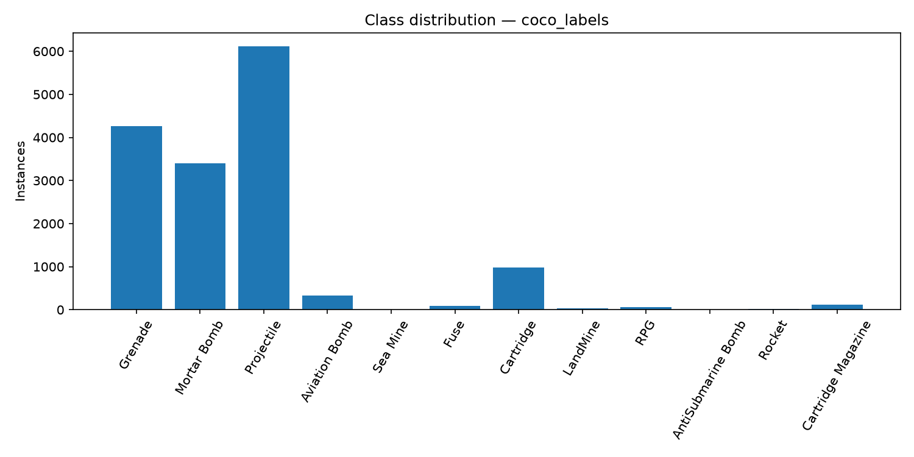
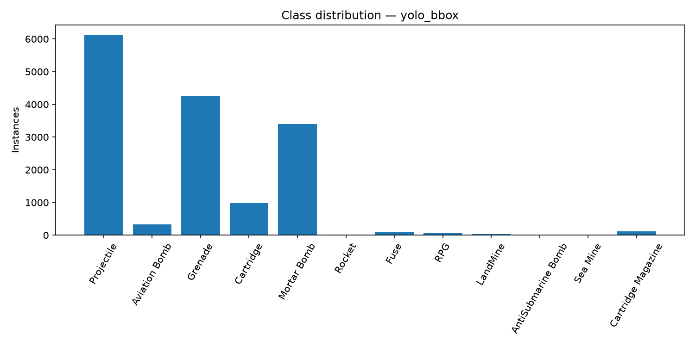
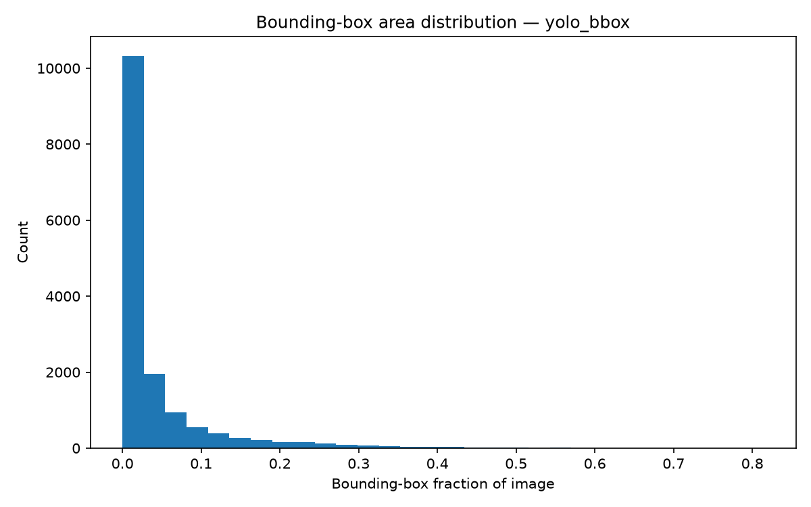
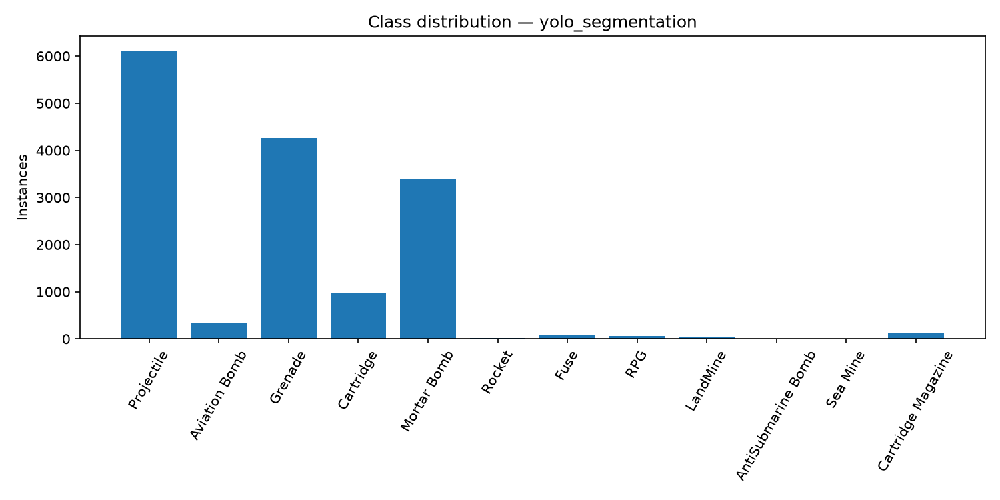
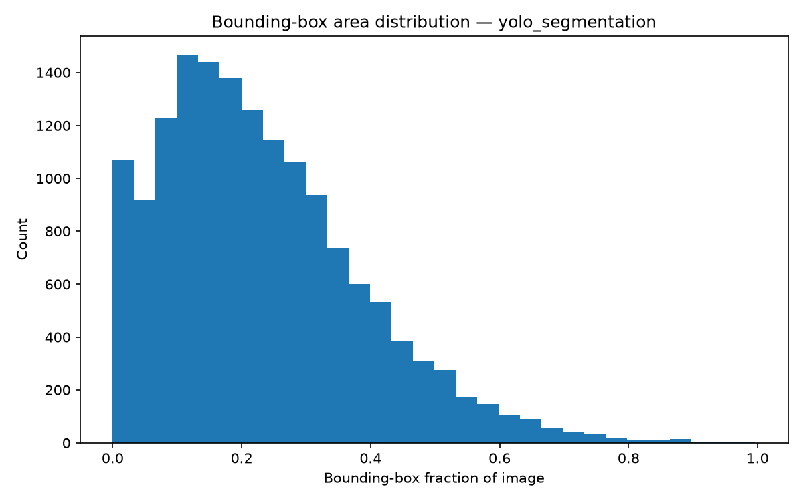
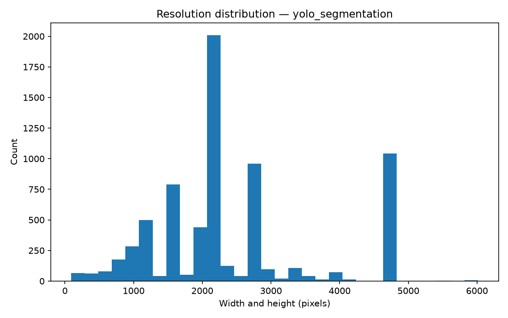

# CTX-UXO Dataset Analysis

Analyzed root: `data/raw/ctx-uxo`

## coco_labels

- Format: `coco`
- Detected purpose: `instance_segmentation`
- Annotation root: `data/raw/ctx-uxo/coco_labels`

| Split | Images | Instances | Average instances/image |
|---|---:|---:|---:|
| test | 529 | 2441 | 4.61 |
| train | 2461 | 11146 | 4.53 |
| validation | 530 | 1862 | 3.51 |

| Class | Instances | Percentage | Assessment |
|---|---:|---:|---|
| Projectile | 6121 | 39.62% | reportable |
| Grenade | 4269 | 27.63% | reportable |
| Mortar Bomb | 3399 | 22.00% | reportable |
| Cartridge | 987 | 6.39% | reportable |
| Aviation Bomb | 333 | 2.16% | limited |
| Cartridge Magazine | 124 | 0.80% | reportable |
| Fuse | 92 | 0.60% | limited |
| RPG | 63 | 0.41% | limited |
| LandMine | 29 | 0.19% | insufficient |
| Rocket | 21 | 0.14% | limited |
| AntiSubmarine Bomb | 6 | 0.04% | limited |
| Sea Mine | 5 | 0.03% | insufficient |

## yolo_bbox

- Format: `yolo`
- Detected purpose: `multiclass_detection`
- Annotation root: `data/raw/ctx-uxo/yolo_bbox`

| Split | Images | Instances | Average instances/image |
|---|---:|---:|---:|
| train | 2461 | 11146 | 4.53 |
| validation | 530 | 1862 | 3.51 |
| test | 529 | 2441 | 4.61 |

| Class | Instances | Percentage | Assessment |
|---|---:|---:|---|
| Projectile | 6121 | 39.62% | reportable |
| Grenade | 4269 | 27.63% | reportable |
| Mortar Bomb | 3399 | 22.00% | reportable |
| Cartridge | 987 | 6.39% | reportable |
| Aviation Bomb | 333 | 2.16% | limited |
| Cartridge Magazine | 124 | 0.80% | reportable |
| Fuse | 92 | 0.60% | limited |
| RPG | 63 | 0.41% | limited |
| LandMine | 29 | 0.19% | insufficient |
| Rocket | 21 | 0.14% | limited |
| AntiSubmarine Bomb | 6 | 0.04% | limited |
| Sea Mine | 5 | 0.03% | insufficient |

## yolo_segmentation

- Format: `yolo`
- Detected purpose: `instance_segmentation`
- Annotation root: `data/raw/ctx-uxo/yolo_segmentation`

| Split | Images | Instances | Average instances/image |
|---|---:|---:|---:|
| train | 2461 | 11146 | 4.53 |
| validation | 530 | 1862 | 3.51 |
| test | 529 | 2441 | 4.61 |

| Class | Instances | Percentage | Assessment |
|---|---:|---:|---|
| Projectile | 6121 | 39.62% | reportable |
| Grenade | 4269 | 27.63% | reportable |
| Mortar Bomb | 3399 | 22.00% | reportable |
| Cartridge | 987 | 6.39% | reportable |
| Aviation Bomb | 333 | 2.16% | limited |
| Cartridge Magazine | 124 | 0.80% | reportable |
| Fuse | 92 | 0.60% | limited |
| RPG | 63 | 0.41% | limited |
| LandMine | 29 | 0.19% | insufficient |
| Rocket | 21 | 0.14% | limited |
| AntiSubmarine Bomb | 6 | 0.04% | limited |
| Sea Mine | 5 | 0.03% | insufficient |

## Limitations

- Serious class imbalance limits meaningful comparisons and makes rare-class claims unsafe.
- The dataset includes replicas as well as real ordnance; results may not transfer to field objects.
- A single geographic and institutional source limits environmental and domain diversity.
- These descriptive statistics do not validate identification performance or operational use.
- A region without an annotation is not proof that no ordnance is present; background distractor labels therefore have medium confidence only.
