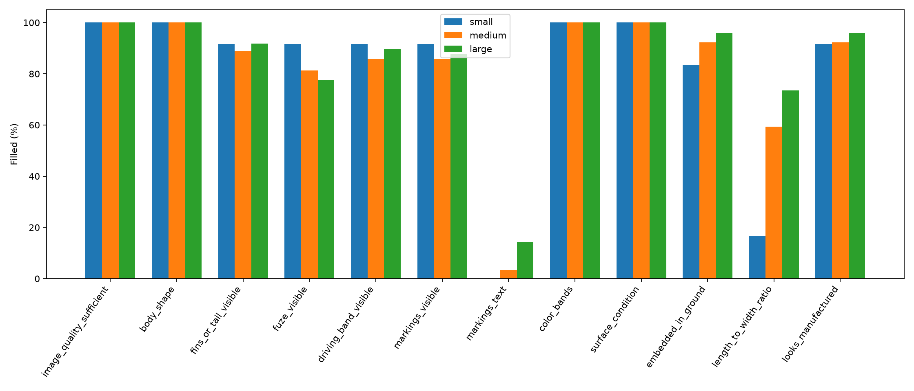
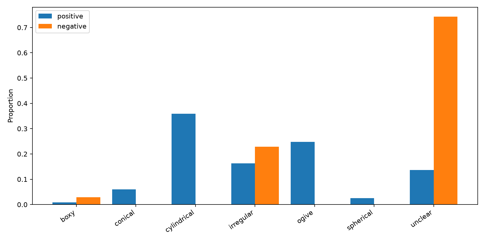
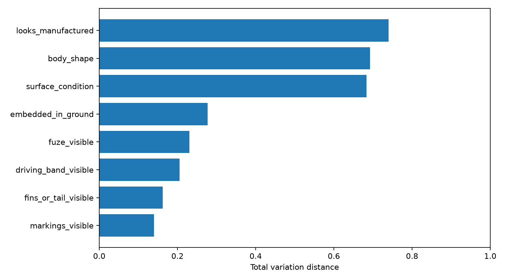

# Observation Report v1

## 1. Run identity

- Model: `gemini-2.5-flash`
- Prompt: `observe_v2`
- Date: 2026-08-13
- Samples: 152 (152 successful, 0 errors)
- Total recorded duration: 1260.0 s
- Tokens: 176320 input, 39971 output
- HTTP 429: 0; retries: 0
- Cache hit rate: 6.6%

## 2. Rule violation scan

Violations: **0**

- No prohibited text found.

## 3. Field completion

`estimated_length_cm`: **not applicable in this eval set (no scale references present)**; excluded from all completion averages.

| Field | Overall | Small | Medium | Large | Positive | Negative |
|---|---:|---:|---:|---:|---:|---:|
| image_quality_sufficient | 100.0% | 100.0% | 100.0% | 100.0% | 100.0% | 100.0% |
| body_shape | 100.0% | 100.0% | 100.0% | 100.0% | 100.0% | 100.0% |
| fins_or_tail_visible | 90.1% | 91.7% | 89.0% | 91.8% | 93.2% | 80.0% |
| fuze_visible | 80.9% | 91.7% | 81.3% | 77.6% | 81.2% | 80.0% |
| driving_band_visible | 87.5% | 91.7% | 85.7% | 89.8% | 89.7% | 80.0% |
| markings_visible | 86.8% | 91.7% | 85.7% | 87.8% | 88.9% | 80.0% |
| markings_text | 6.6% | 0.0% | 3.3% | 14.3% | 8.5% | 0.0% |
| color_bands | 100.0% | 100.0% | 100.0% | 100.0% | 100.0% | 100.0% |
| surface_condition | 100.0% | 100.0% | 100.0% | 100.0% | 100.0% | 100.0% |
| embedded_in_ground | 92.8% | 83.3% | 92.3% | 95.9% | 99.1% | 71.4% |
| length_to_width_ratio | 60.5% | 16.7% | 59.3% | 73.5% | 76.1% | 8.6% |
| looks_manufactured | 93.4% | 91.7% | 92.3% | 95.9% | 96.6% | 82.9% |

## 4. Discriminativeness analysis

| Rank | Field | Positive distribution | Negative distribution | TV distance |
|---:|---|---|---|---:|
| 1 | looks_manufactured | `{True: 110, None: 4, False: 3}` | `{False: 22, None: 6, True: 7}` | 0.740 |
| 2 | body_shape | `{'cylindrical': 42, 'ogive': 29, 'unclear': 16, 'conical': 7, 'irregular': 19, 'boxy': 1, 'spherical': 3}` | `{'unclear': 26, 'irregular': 8, 'boxy': 1}` | 0.692 |
| 3 | surface_condition | `{'heavily_corroded': 66, 'unclear': 6, 'corroded': 8, 'weathered': 31, 'clean': 6}` | `{'unclear': 19, 'weathered': 16}` | 0.684 |
| 4 | embedded_in_ground | `{False: 89, True: 27, None: 1}` | `{False: 22, None: 10, True: 3}` | 0.277 |
| 5 | fuze_visible | `{False: 68, True: 27, None: 22}` | `{False: 28, None: 7}` | 0.231 |
| 6 | driving_band_visible | `{False: 81, None: 12, True: 24}` | `{False: 28, None: 7}` | 0.205 |
| 7 | fins_or_tail_visible | `{True: 19, False: 90, None: 8}` | `{False: 28, None: 7}` | 0.162 |
| 8 | markings_visible | `{True: 23, False: 81, None: 13}` | `{False: 26, None: 7, True: 2}` | 0.139 |

## 5. Family profiles

| Family | n | Field | Modal value | Count | Rate |
|---|---:|---|---|---:|---:|
| aviation_bomb | 21 | looks_manufactured | True | 20 | 95.2% |
| aviation_bomb | 21 | body_shape | cylindrical | 10 | 47.6% |
| aviation_bomb | 21 | surface_condition | heavily_corroded | 19 | 90.5% |
| aviation_bomb | 21 | fins_or_tail_visible | False | 15 | 71.4% |
| aviation_bomb | 21 | fuze_visible | False | 15 | 71.4% |
| aviation_bomb | 21 | driving_band_visible | False | 17 | 81.0% |
| aviation_bomb | 21 | markings_visible | False | 16 | 76.2% |
| aviation_bomb | 21 | embedded_in_ground | True | 11 | 52.4% |
| cartridge | 10 | looks_manufactured | True | 7 | 70.0% |
| cartridge | 10 | body_shape | unclear | 4 | 40.0% |
| cartridge | 10 | surface_condition | heavily_corroded | 5 | 50.0% |
| cartridge | 10 | fins_or_tail_visible | False | 9 | 90.0% |
| cartridge | 10 | fuze_visible | False | 9 | 90.0% |
| cartridge | 10 | driving_band_visible | False | 9 | 90.0% |
| cartridge | 10 | markings_visible | False | 8 | 80.0% |
| cartridge | 10 | embedded_in_ground | False | 6 | 60.0% |
| fuze | 14 | looks_manufactured | True | 12 | 85.7% |
| fuze | 14 | body_shape | irregular | 8 | 57.1% |
| fuze | 14 | surface_condition | weathered | 8 | 57.1% |
| fuze | 14 | fins_or_tail_visible | False | 14 | 100.0% |
| fuze | 14 | fuze_visible | False | 6 | 42.9% |
| fuze | 14 | driving_band_visible | False | 14 | 100.0% |
| fuze | 14 | markings_visible | False | 10 | 71.4% |
| fuze | 14 | embedded_in_ground | False | 12 | 85.7% |
| grenade | 19 | looks_manufactured | True | 18 | 94.7% |
| grenade | 19 | body_shape | irregular | 8 | 42.1% |
| grenade | 19 | surface_condition | weathered | 9 | 47.4% |
| grenade | 19 | fins_or_tail_visible | False | 19 | 100.0% |
| grenade | 19 | fuze_visible | True | 12 | 63.2% |
| grenade | 19 | driving_band_visible | False | 18 | 94.7% |
| grenade | 19 | markings_visible | False | 12 | 63.2% |
| grenade | 19 | embedded_in_ground | False | 18 | 94.7% |
| landmine | 2 | looks_manufactured | True | 2 | 100.0% |
| landmine | 2 | body_shape | unclear | 2 | 100.0% |
| landmine | 2 | surface_condition | heavily_corroded | 2 | 100.0% |
| landmine | 2 | fins_or_tail_visible | False | 2 | 100.0% |
| landmine | 2 | fuze_visible | None | 1 | 50.0% |
| landmine | 2 | driving_band_visible | False | 2 | 100.0% |
| landmine | 2 | markings_visible | True | 1 | 50.0% |
| landmine | 2 | embedded_in_ground | True | 1 | 50.0% |
| mortar | 19 | looks_manufactured | True | 19 | 100.0% |
| mortar | 19 | body_shape | ogive | 13 | 68.4% |
| mortar | 19 | surface_condition | heavily_corroded | 8 | 42.1% |
| mortar | 19 | fins_or_tail_visible | True | 12 | 63.2% |
| mortar | 19 | fuze_visible | False | 8 | 42.1% |
| mortar | 19 | driving_band_visible | True | 11 | 57.9% |
| mortar | 19 | markings_visible | False | 11 | 57.9% |
| mortar | 19 | embedded_in_ground | False | 14 | 73.7% |
| not_ordnance | 35 | looks_manufactured | False | 22 | 62.9% |
| not_ordnance | 35 | body_shape | unclear | 26 | 74.3% |
| not_ordnance | 35 | surface_condition | unclear | 19 | 54.3% |
| not_ordnance | 35 | fins_or_tail_visible | False | 28 | 80.0% |
| not_ordnance | 35 | fuze_visible | False | 28 | 80.0% |
| not_ordnance | 35 | driving_band_visible | False | 28 | 80.0% |
| not_ordnance | 35 | markings_visible | False | 26 | 74.3% |
| not_ordnance | 35 | embedded_in_ground | False | 22 | 62.9% |
| projectile | 19 | looks_manufactured | True | 19 | 100.0% |
| projectile | 19 | body_shape | cylindrical | 13 | 68.4% |
| projectile | 19 | surface_condition | heavily_corroded | 18 | 94.7% |
| projectile | 19 | fins_or_tail_visible | False | 17 | 89.5% |
| projectile | 19 | fuze_visible | False | 17 | 89.5% |
| projectile | 19 | driving_band_visible | False | 10 | 52.6% |
| projectile | 19 | markings_visible | False | 14 | 73.7% |
| projectile | 19 | embedded_in_ground | False | 17 | 89.5% |
| rocket | 13 | looks_manufactured | True | 13 | 100.0% |
| rocket | 13 | body_shape | cylindrical | 6 | 46.2% |
| rocket | 13 | surface_condition | heavily_corroded | 8 | 61.5% |
| rocket | 13 | fins_or_tail_visible | False | 9 | 69.2% |
| rocket | 13 | fuze_visible | False | 7 | 53.8% |
| rocket | 13 | driving_band_visible | True | 7 | 53.8% |
| rocket | 13 | markings_visible | False | 9 | 69.2% |
| rocket | 13 | embedded_in_ground | False | 11 | 84.6% |

## 6. Length-to-width ratio by family

| Family | n | Q1 | Median | Q3 |
|---|---:|---:|---:|---:|
| aviation_bomb | 15 | 2.80 | 3.50 | 3.50 |
| cartridge | 3 | 3.50 | 3.50 | 4.00 |
| fuze | 13 | 2.20 | 2.50 | 2.50 |
| grenade | 16 | 1.45 | 1.60 | 1.80 |
| landmine | 1 | 1.10 | 1.10 | 1.10 |
| mortar | 16 | 3.50 | 3.50 | 4.50 |
| not_ordnance | 3 | 1.25 | 1.50 | 2.50 |
| projectile | 14 | 3.50 | 3.50 | 3.50 |
| rocket | 11 | 3.00 | 3.50 | 4.50 |

## 7. Most frequent unclear-feature reasons

| Rank | Field | Reason | Count |
|---:|---|---|---:|
| 1 | estimated_length_cm | no manual scale reference | 133 |
| 2 | markings_text | no visible markings to transcribe | 104 |
| 3 | length_to_width_ratio | object partially outside frame | 12 |
| 4 | markings_text | marking is not legible | 4 |
| 5 | estimated_length_cm | no discernible object and no manual scale reference | 4 |
| 6 | surface_condition | no object visible | 3 |
| 7 | markings_visible | heavy corrosion prevents assessment of surface for markings | 3 |
| 8 | length_to_width_ratio | no object visible | 3 |
| 9 | length_to_width_ratio | no distinct object visible | 3 |
| 10 | estimated_length_cm | no distinct object visible and no manual scale reference | 3 |
| 11 | embedded_in_ground | no object visible | 3 |
| 12 | body_shape | no object visible | 3 |
| 13 | body_shape | no distinct object visible | 3 |
| 14 | markings_text | no visible markings to transcribe due to heavy corrosion | 2 |
| 15 | markings_text | markings_visible is null | 2 |

## 8. Limitations

- The sample is small; landmine has 2 samples and the insufficient tier is generally inadequate.
- Most small samples are cartridge; size and family effects cannot be disentangled.
- Negatives rely on annotation absence; no independent ‘not ordnance’ verification was performed.
- Crops come from one dataset and include replicas.
- This is one model and one run; variance was not measured.
- This report measures observation consistency; it **does not measure identification accuracy**.

